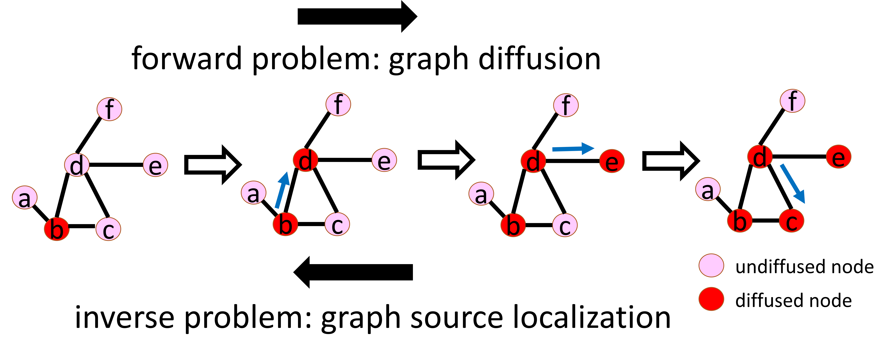

# Summary

# Statement of need
{label="fig:example"}
Graphs are prevalent data structures where nodes are connected by their relations, finding wide application across various domains. In graph mining, a fundamental task is graph diffusion, which aims to predict future graph cascade patterns given source nodes. Conversely, its inverse problem, graph source localization, though rarely explored, stands as an extremely important topic: it focuses on detection of source nodes given their future graph cascade patterns. As illustrated in Figure \ref{fig:example}, graph diffusion seeks to predict the cascade pattern $\{b,c,d,e\}$ from a source node $b$, whereas graph source localization aims to identify source nodes $b$ from the cascade pattern $\{b,c,d,e\}$. Graph source localization spans a broad spectrum of promising research and real-world applications. For instance, online social media platforms like Twitter and Facebook have been instrumental in disseminating rumors and misinformation with significant repercussions [@evanega2020coronavirus]. Additionally, the rapid propagation of computer viruses across the Internet, infecting millions of computers, underscores the critical need for tracking their sources [@kephart1993measuring]. Moreover, in smart grids, where isolated failures can trigger rolling blackouts leading to substantial financial losses [@amin2007preventing], graph source localization plays a pivotal role. Hence, the graph source localization problem demands attention and extensive investigations from machine learning researchers.

# Package Descriptions

## Algorithms

## Benchmark Datasets

# Availability and Documentation

# Acknowledgements

The support from Junji Jiang is acknowledged during the development of the GSL library.

# References
